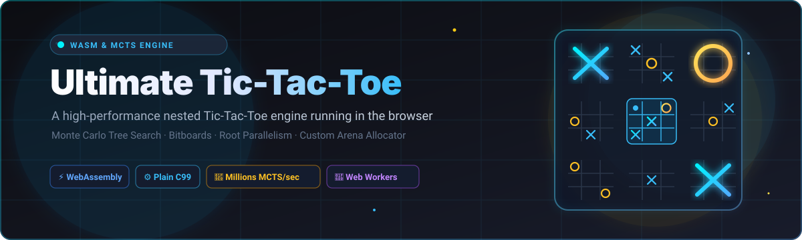
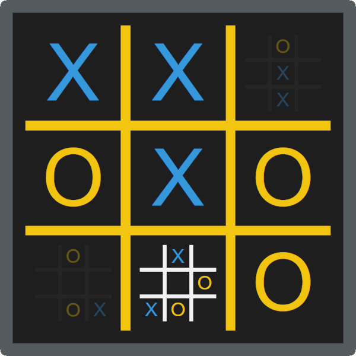

<p align="center">
  
</p>

# 🎮 Ultimate Tic-Tac-Toe

A high performance Ultimate Tic-Tac-Toe engine in the browser. ⚡

<p align="center">
  <a href="https://github.com/ishandutta2007/Awesome-Awesome-Awesome"></a>
  <a href="https://discord.gg/jc4xtF58Ve"></a>
  <a href="https://github.com/ishandutta2007/uttt/stargazers"></a>
  <a href="https://github.com/ishandutta2007/uttt/network/members"></a>
  <a href="LICENSE"></a>
  <a href="https://github.com/ishandutta2007"></a>
</p>




## 📖 What is Ultimate Tic-Tac-Toe

Basically, it's a less boring and more sophisticated version of tic-tac-toe. 🕹️

The rules are:

> 1. 🎯 Each turn, you mark one of the small squares.
> 2. 🏆 When you get three in a row on a small board, you’ve won that board.
> 3. 👑 To win the game, you need to win three small boards in a row.
>
> ❓ **You don’t get to pick which of the nine boards to play on.** That’s
> determined by your opponent’s previous move. Whichever square he picks,
> that’s the board you must play in next. (And whichever square you pick will
> determine which board he plays on next.)
>
> 🔄 **What if my opponent sends me to a board that’s already been won?** In that
> case, congratulations – you get to go anywhere you like, on any of the other
> boards.
>
> 🤝 **What if one of the small boards results in a tie?** That board counts for
> neither X nor O.

🔗 [Source](https://mathwithbaddrawings.com/2013/06/16/ultimate-tic-tac-toe/)

## 🤖 About the AI

The AI uses the Monte Carlo tree search algorithm. 🧠

Some clever design decisions were made to make the AI as fast as possible:

- ⚡ Written in plain C99, compiled to WebAssembly without any standard library
- 🏎️ Bitboard representation for extremely fast move generation
- 📊 Lookup-table for win-checking
- 🧩 Fast, memory-efficient game-tree architecture with custom arena allocator
- 🧵 Root parallelism using multiple web workers

With these optmizations, the AI is capable of running millions of MCTS
iterations per move, which makes it very powerful despite its rudimentary
implementation of MCTS. 🚀

Some future improvements:

- 🔮 Incorporate Proof-number search to prune the search tree
- ♻️ Search tree reuse (have to replace the arena allocator with a pool allocator)
- 📐 Positional analysis

## 🚀 Usage

🌐 Go to the deployed website: <https://ishandutta2007.github.io/uttt>

💻 To run the application locally:

```bash
# Serve the app locally with your HTTP server of choice
python3 -m http.server 8080

# Launch the app in your browser of choice
firefox http://localhost:8080
```

## 🛠️ Compiling

If you want to recompile the WASM modules, you will need:

- 🔧 clang (tested with version 15.0.7)
- 🔗 wasm-ld
- 💻 a POSIX-compliant shell (tested with GNU bash version 5.2.15)

Run the `build.sh` script to compile everything. ⚙️

##  Star History
[](https://star-history.dera.page/#ishandutta2007/uttt&type=date&legend=top-left)

## 📜 License

This app is licensed under the [AGPL-3.0 license](LICENSE). 📄


